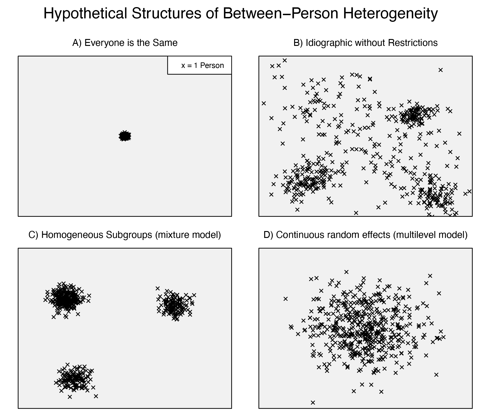
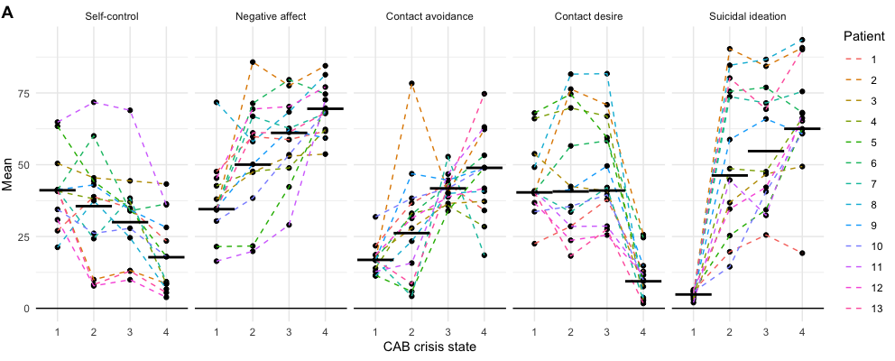

```{r setup, include=FALSE}
knitr::opts_chunk$set(echo = FALSE)
library(mHMMbayes)
library(ggplot2)
```

## So far.. 

Introduction to the HMM using the example of CAB crisis states

Here, we investigated 

- State composition at the group level
- State dynamics at the group level
- Most likely state sequence over time

Same topics in the practical, using data on mood. 


## Now:

Expand the HMM to the multilevel framework 

- Enabling individual specific parameters
- Using the example of CAB crisis states

And 

- Model selection problem
- Model fit
- Using the example of CAB crisis states


---

<div align="center">
<br>
<br>
<br>
<font size="10"> **Multilevel framework **</font>
<br>
<br>
<br>
<br>
<font size="6"> Individual specific models of dynamics </font>
</div>

## Conventional HMM: desinged for single sequence
<div style = "float: left; width: 55%;">
Analyzing data from multiple individuals

<font size="5"> 

- A: strong assumption: individuals do not differ with respect to process dynamics
- A: explain some of the differences using covariates (e.g., R package depmixS4)
- B: composition of states not related over individuals, inefficient use of data 
- A, B, and C do not allow for:  
    - (quantification of) natural variation between individuals
    - individual specific dynamics over time

</font>
</div>

<div style = "float: right; width: 45%;">
<div align="left">
<br>
</div>
</div>


## Extending the HMM to a multilevel framework
Including a multilevel framework for the HMM, enables simultaneous estimation:

- group level parameter estimates 
- individual specific parameter estimates for each individual $n$ 

For the variable & state dependent emission Normal means:

- $\quad {\mu_{nki} = \bar{\mu}_{ki} + \epsilon_{\left[\mu\right]nki}}$

For the state dynamics: 

- Multinomial logistic regression to estimate transition probabilities $\gamma_{nij}$ 

- $\gamma_{nij} = \frac{\text{exp}(\alpha_{nij})}{1 + \sum_{{j} = 2}^m \text{exp}(\alpha_{ni{j}})} \quad$ where $\quad \alpha_{nij} = \bar{\alpha}_{ij} + \epsilon_{\left[\alpha\right]nij}$


## Extending the HMM to a multilevel framework

Adopt a Bayesian approach

Individual specific means / intercepts are sampled from a Normal distribution 

Combining: 

- The prior distribution:  
    - Group level distribution denoting overall mean of parameter over individuals, and 
    - Variability in the parameter between individuals
- The 'observed data':  
    - The observed data within a state

## The mHMMbayes package: an example

<div align="center">
<br>

</div>

26 patients, 60 observations per patient per CAB factor

## Individual level - emission distribution 

```{r, echo = TRUE, eval = FALSE}
emiss_subj <- obtain_emiss(CAB_mHMM_4st, level = "individual")
```

<div align="center">
<br>
<br>

</div>

## Individual level - emission distribution 

```{r, echo = TRUE, eval = FALSE}
emiss_subj <- obtain_emiss(CAB_mHMM_4st, level = "individual")
```

Important to check conceptual state equivalence over individuals! 

<div align="center">

</div>

## CAB crisis state dynamics 

<div align="center">
<br>

</div>

## Individual level - state dynamics 
```{r, echo = TRUE, eval = FALSE}
gamma_subj <- obtain_gamma(CAB_mHMM_4st, level = "individual")
```

<div align="center">
<br>

</div>


## Capturing crisis dynamics -- conclusion 

Pairing fine grained ESM data with multilevel HMM, we

- Identified four distinct and ascending CAB based crisis states
- Quantified the dynamics of crisis at the group level 
- Visualized crisis states over time at the patient individual level
- Observed considerable variation between patients, both in remaining within and transitioning between CAB crisis states
- Highlighted the need for a personalized method 

---

<div align="center">
<br>
<br>
<br>
<font size="10"> **Model selection**</font>
<br>
<br>
<br>
<br>
<font size="6"> A pragmatic step by step approach </font>
</div>

## Model selection: how many states? 

Number of states is a fixed 'parameter' in the model, to be determined by the researcher. 

- AIC and BIC tend to favor models with (undesirably) large numbers of states. 

<div>
<br>
<br>
<br>
<br>
<br>
<br>
<br>
<font size="4">
Note: within Bayesian framework, can make the number of states a model parameter using a reversible jump MCMC algorithm, but within the context of a multilevel model, computationally too intense. </font>
</div>

## Model selection: how many states? 

Pohle & Langrock (2017) suggested a pragmatic step-by-step approach: 

- Decide a priori plausible min and max number of states.
- Fit decided on models.
- Inspect state composition of fitted models.
- Use model checking to include / exclude models.  
    - In case of Bayesian framework: model convergence!
- Consider model selection criteria for guidance.
- Make a choice, also based on **study aim and expert knowledge**, and computational considerations. 
- When no clear preference, report all (viable) models.

## Model selection: example

<div align="center">
<br>

</div>


## Model selection: state composition

<div align="center">

</div>

## Model selection: state composition

<div align="center">

</div>

## Model selection: state composition

<div align="center">

</div>

## Model selection: state composition

<div align="center">

</div>

## Model selection: convergence

| Mean Rhat (\% $>$ 1.2)   | 2-state model| 3-state model| 4-state model| 5-state model|
| :----------------------: | :----------: | :----------: | :----------: |:-----------: |
|                          |              |              |              |
| Transition parameters    | 1.02 (0.0\%) |	1.01 (0.0\%) | 1.02 (6.25\%) |	1.04 (16.0\%) |
| Composition parameters   | 1.01 (0.0\%) | 1.01 (0.0\%) | 1.03 (0.0\%) | 1.04 (4.0\%) |


## Model selection: model selection criteria
```{r, fig.align='center', fig.width=8, fig.height=4}
AIC <- data.frame(AIC = c(2664.32, 2630.36, 2616.45, 2623.73), 
                  states = c(2:5))
ggplot(AIC, mapping = aes(x = states, y = AIC)) +
  geom_point() + 
  geom_line() +
  ggtitle("AIC over the 2 - 5 state models") + 
  xlab("Number of states") +
  theme_minimal()
```


---

<div align="center">
<br>
<br>
<br>
<font size="10"> **Model checking**</font>
<br>
<br>
<br>
<br>
<font size="6"> Label switching, Convergence, PPCs and pseudo residuals </font>
</div>

## Model checking: convergence

Check: rule out results from a local (instead of global) maximum. 

How to check convergence: 

 1) Fit the multilevel HMM multiple times, using different starting values 

$\rightarrow$ multiple MCMC chains. 

- Keep same sensible ordering of $\bar{\mu}_i$ or $\bar{\lambda}_i$ given data and process. 
- Values of weakly informative prior distributions should be fixed over the chains.


## Model checking: convergence
<ol start=2>
<li> Inspect the chains for evidence of non-convergence:
</ol>

- Visually:   
    - Trace plots $\rightarrow$ parameter estimates over iterations of the MCMC sampler. Chains should not show any trend and good mixing. 
    - Density plots $\rightarrow$ posterior distribution. Should be unimodal. 
- Numerically with potential scale reduction factor $\hat{R}$:  
    - Tests for equality of means of the different chains 
    - A value of R-hat below 1.2 is used to indicate convergence. 


## Model checking: convergence - example

<div align="center">

</div>

## Model checking: convergence - example

| Mean Rhat (\% $>$ 1.2)   | 4-state model| 
| :----------------------: | :----------: | 
|                          |              | 
| Transition parameters    | 1.02 (6.25\%) | 
| Composition parameters   | 1.03 (0.0\%) | 

## Model checking: label switching
In mixture models, such as HMMs, the orderning of the hidden states do not affect the fit (i.e., likelihood) of the model.

Consequence: 

- In Bayesian estimation, the ordering of the states (e.g., state 1: good mood, state 2: bad mood) may switch over the iterations of the estimation procedure

In multilevel HMMs: 

- Occurs at the level of the individual estimates. Severe label switching may also affect the group level estimates. 

How to check: 

- traceplots of the parameters at the individual level 

## Model checking: label switching

<div align="center">

</div>

## Model checking: label switching
<div style = "float: left; width: 40%;">
<br>
<br>
Occurrence depends on:

- Amount of state separation, 
- Number of variables $p$, 
- Sample size ($N_{Ind}$ and $N_t$). 
</div>

<div style = "float: right; width: 60%;">
<div align="center">
<br>

</div>
</div>

## Model checking: label switching

<div style = "float: left; width: 40%;">
<br>
<br>
Occurrence depends on:

> - Amount of state separation, 
> - Number of variables $p$, 
> - Sample size ($N_{Ind}$ and $N_t$). 
</div>
</div>

<div style = "float: right; width: 60%;">
<div align="center">
<br>

</div>
</div>

## Model checking: label switching

Severe label switching: 

  - model is not viable. 

Minor label switching:  

  - manually switch back labels of switched parts or 
  - do not interpret results for individuals with label switching. 

## Model checking: Posterior predictive checks 

Check: does model recover the data correctly on an array of characteristics, aids in revealing model missspecification.

1. Fit a MHMM to the data.
2. Generate simulated data sets based on obtained parameter estimates.
3. For each simulated data set, calculate summary statistics of interest (e.g., mean or variance) and compare to the observed data.
4. Check visually and/or construct an empirical posterior predictive value (PPV)  
    - PPV ranges from 0 to 1.   
    - Good fit: PPV takes intermediate values.
    - Poor fit: PPV takes extreme values (i.e., <0.025 or >0.975). 
    
PPCs can be used to assess model fit at both the individual and group-level.

## Model checking: PPCs - example

<div align="center">
<br>

</div>

## Model checking: PPCs - example

<div align="center">
<br>

</div>


## Model checking: Pseudo residuals 

Check: is the model a good fit to the data of each individual?

- Using the  
    - sequence of most likely states for each individual
    - individual specific parameter estimates for the emission distribution 
- we predict the most likely outcome at each point in time.  
    - E.g., when modelling continuous data $\rightarrow$ individual and state specific mean of most likely state at each point in time. 

Pseudo residuals at each time point: observed - predicted outcome. 

Use for typical residual checking: e.g., normality, heteroscedasticity, lack of trend over time, and autocorrelation. 

## Model checking: Pseudo residuals - example

<div align="center">
<br>
<br>

</div>

## Model checking: Pseudo residuals - example

<div align="center">
<br>
<br>

</div>


## Model checking: Pseudo residuals - example

<div align="center">
<br>
<br>

</div>


## Start practical 2

<div>
<br>
<br>
<br>
</div>

Let's continue with our own multilevel HMM in the lab! 


<div>
<br>
<br>
<br>
All materials are available on:

https://github.com/emmekeaarts/workshop_SAA_mHMM_2025
</div>

## References 

- <font size="3"> Pohle, J., Langrock, R., Van Beest, F. M., & Schmidt, N. M. (2017). Selecting the number of states in hidden Markov models: pragmatic solutions illustrated using animal movement. Journal of Agricultural, Biological and Environmental Statistics, 22, 270-293. DOI: 10.1007/s13253-017-0283-8 </font>

## mHMMbayes - Metropolis within Gibbs sampler

1. Obtain forward probabilities $\alpha_{t(ni)} = Pr\big(O_1 = o_1, ..., O_t = o_t, S_t = i\big)$ for each subject using current values of subject specific model parameters.
2. Sample hidden state sequences in backward manner using $\alpha_{t(ni)}$ and $\gamma_{nij}$.
3. Given current subject-specific parameters, draw new group-level parameter estimates using Gibbs step
4. Given 
    - observed event sequence for each subject
    - sampled hidden state sequence for each subject
    - group-level parameter distributions
    - draw new subject-specific parameters using RW Metropolis sampler
5. Repeat step 1-4 a very large number of times
